<!-- Updated using CONTEXT.md -->
<!-- ===================================================== -->
<!--               RAHUL BOHRA — GitHub Profile            -->
<!-- ===================================================== -->

<div align="center">

<!-- Animated Header -->

<br/><br/>
<!-- Status Badges with Glow Effect -->


<br/><br/>

<!-- Animated Typing SVG -->

<!-- Animated Wave Divider -->

</div>

---

## 🎯 The Mission

<div align="center">

> **"Solving problems and creating value through building products"**

</div>

I am a **Product Manager at ICICI Bank** who loves building AI-first software products from scratch. I don't just manage products—I validate ideas, build MVPs, design monetization, improve user experience, and iterate rapidly using AI. 

I think like a founder, with the long-term goal of building products used by millions while becoming one of the strongest Product + AI builders in India.

---

## 🚀 Featured Projects

<table>
<tr>
<td width="50%" valign="top">

### 🧠 [Zyromit](https://github.com/bohrarahul) `IN PROGRESS`

**Cross-border remittances & USDT transactions for NRIs.**

Defined product strategy, PRDs, user flows, and MVP roadmap. Built compliance infrastructure incorporating KYC/AML tracking.

```
Remittance Request
       ↓
 KYC/AML Verification
       ↓
Secure Transaction Track
       ↓
  USDT / Fiat Delivery
```

**Stack:** Python • Supabase • REST APIs • KYC/AML Integration

</td>
<td width="50%" valign="top">

### 🎓 [GradAI](https://github.com/bohrarahul) `COMPLETE`

**AI-powered answer evaluation platform for educators.**

Streamlines grading processes using OCR and semantic RAG pipelines. Saves 70% of evaluation time for teachers.

```
Scan Answer Sheet (OCR)
       ↓
 Retrieve Rubrics (RAG)
       ↓
 LLM Grading & Feedback
       ↓
 70% Teacher Time Saved
```

**Stack:** Python • OCR • RAG • LLMs (GPT/Claude)

</td>
</tr>
<tr>
<td valign="top">

### 🗺️ [DineTrust](https://github.com/bohrarahul) `COMPLETE`

**AI-powered social dining discovery ("Letterboxd for food").**

A friend-first dining map for sharing restaurant experiences. Built with Expo/Flutter, Firebase, and Google Places.

```
Google Places API
       ↓
Location Check-in Map
       ↓
Recommendation Engine
       ↓
Instagram Story Generator
```

**Stack:** React Native (Expo) • Flutter • Firebase • Supabase

</td>
<td valign="top">

### 👥 [ViralVintage](https://github.com/bohrarahul) `COMPLETE`

**Two-sided creator marketplace & monetization engine.**

Enables creator discovery, brand collaboration, and pay-per-view monetization. Developed custom pricing & distribution engines.

```
Creator Discovery
       ↓
Brand Collaboration
       ↓
Pay-Per-View Paywall
       ↓
Pricing & Distribution
```

**Stack:** React • Firebase • Firestore • Payment APIs

</td>
</tr>
</table>

---

## ⚡ How I Think

```mermaid
graph LR
    A[Identify Real Problem] --> B[Validate with Users]
    B --> C[Build & Ship MVP]
    C --> D[Embed AI & Analytics]
    D --> E[Measure & Monetize]
    E --> F[Iterate Continuously]
    
    style A fill:#ff6b6b,stroke:#ee5a5a,color:#fff
    style B fill:#feca57,stroke:#f9b234,color:#333
    style C fill:#48dbfb,stroke:#0abde3,color:#333
    style D fill:#ff9ff3,stroke:#f368e0,color:#333
    style E fill:#54a0ff,stroke:#2e86de,color:#fff
    style F fill:#00d2d3,stroke:#01a3a4,color:#fff
```

<div align="center">



Products should solve one real problem exceptionally well, launch fast, and iterate continuously based on user validation. I believe in embedding AI and metrics early to drive monetization and scalability.

</div>

---

## What I Work With

<div align="center">

### 💼 Product & Strategy
<p>


</p>

### 🤖 AI & Technical
<p>


</p>

### 📱 Frontend & Mobile
<p>


</p>

### ⚙️ Tools & Operations
<p>


</p>

</div>

---
## 🔭 Currently Exploring

<div align="center">


<br/><br/>


</div>

---

## 💡 Product Philosophy

<div align="center">

> **"Solve one real problem exceptionally well. Launch fast. Validate with users. Iterate continuously. Use AI wherever it creates leverage. Measure everything."**
> 
> *I prefer execution over perfection.*

</div>

---

## 📫 Connect

<div align="center">

<a href="https://linkedin.com/in/bohrarahull">
  
</a>
<a href="#" target="_blank">
  
</a>
<a href="mailto:rahul.bohra.042@gmail.com">
  
</a>
<a href="https://github.com/bohrarahul">
  
</a>
<br/>
<!--  -->

</div>

---

<div align="center">

### Thanks for stopping by!

**Building AI products • Learning continuously • Shipping relentlessly**


</div>
